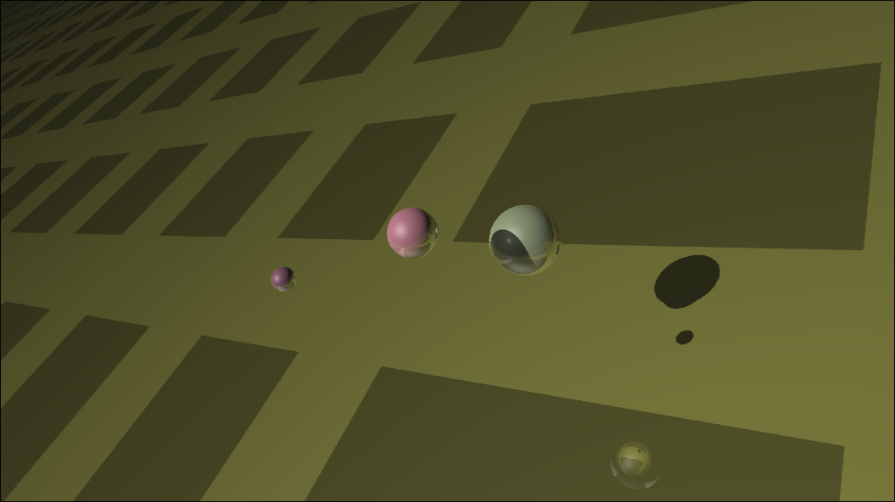
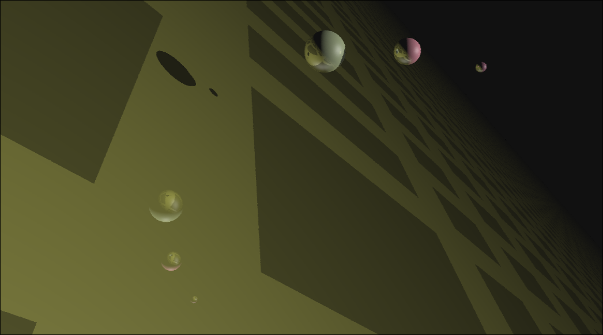
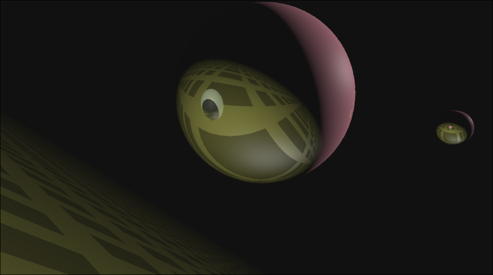

# RayTracerGL
## Images of execution of the src files:





A GPU ray tracer written from scratch with **C++23, OpenGL 4.6 and GLSL compute shaders**.

RayTracerGL renders a small interactive 3D scene by generating camera rays directly on the GPU. The renderer uses jittered samples for anti-aliasing, recursive reflection, direct lighting and shadow rays.

> This project is primarily an exploration of GPU ray tracing and real-time rendering techniques using the OpenGL compute pipeline.

## Features

- GPU ray tracing using an OpenGL compute shader
- OpenGL 4.6 core profile
- GLSL compute shaders
- Sphere intersection
- Large ground-plane intersection
- Jittered multi-sample anti-aliasing
- Recursive reflection
- Directional lighting
- Hard shadow rays
- Diffuse and specular shading
- Shader storage buffer objects (SSBOs) for scene data
- Floating-point render target (`RGBA32F`)
- Interactive first-person camera
- Gamma correction
- CMake-based build system

## Rendering pipeline

The renderer separates ray generation from presentation:

1. C++ creates the OpenGL context and uploads scene data.
2. The compute shader generates camera rays.
3. Each pixel uses multiple jittered samples.
4. Rays intersect the scene geometry.
5. The shader evaluates direct lighting and shadow visibility.
6. Reflected rays are traced for additional interactions.
7. The final color is written to an `RGBA32F` image.
8. A fullscreen triangle/quad pass displays the result.

## Sampling

Each pixel is evaluated using four jittered samples.

The jitter is generated in the compute shader with a small integer hash-based random generator.

This reduces the visible aliasing produced by tracing one deterministic ray per pixel.

## Ray interaction

The current renderer supports:

- primary camera rays
- sphere intersections
- plane intersection
- direct illumination
- shadow visibility tests
- reflected rays

The current implementation limits ray interactions to a small fixed depth to keep the renderer suitable for interactive use.

## Scene representation

Scene objects are stored in an OpenGL shader-storage buffer.

Each object contains:

```cpp
struct Object {
    float radius;
    glm::vec3 center;
    glm::vec3 color;
};
```

The GPU reads this buffer directly from the compute shader.

This keeps the scene representation simple and makes it easy to experiment with GPU-side intersection algorithms.

## GPU execution

The renderer uses:

```glsl
layout(local_size_x = 32,
       local_size_y = 32,
       local_size_z = 1) in;
```

The current render target is `1024 × 1024`, resulting in a `32 × 32` grid of workgroups.

Each GPU invocation is responsible for one output pixel.

## Requirements

- CMake 3.25+
- C++23 compiler
- OpenGL 4.6 capable GPU/driver
- GLFW3
- GLM
- GLAD

The project is configured through CMake and links against OpenGL, GLFW and GLM.

## Build

### Linux

Install the required development packages first.

Then build:

```bash
git clone https://github.com/Leonuraht/RayTracerGL.git
cd RayTracerGL

cmake -S . -B build -DCMAKE_BUILD_TYPE=Release
cmake --build build -j
```

Run:

```bash
./build/app
```

## Current renderer design

The renderer is intentionally compact rather than being a general-purpose ray-tracing engine.


## Limitations

The current implementation is an experimental renderer. It does not yet include:

- BVH or other acceleration structures
- Triangle mesh loading
- Physically based materials
- Refraction
- Importance sampling
- Temporal accumulation
- Denoising
- Progressive path tracing
- GPU hardware ray-tracing extensions

Scene geometry is currently simple and is defined directly in the renderer.
